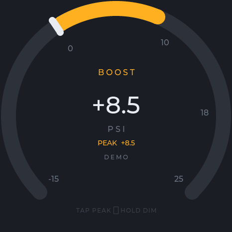
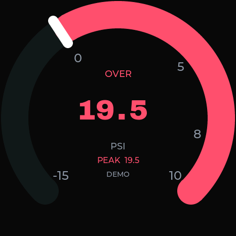

# Boost Gauge

An open-source digital boost/vacuum gauge and dashboard for the **[Waveshare ESP32-S3-Touch-AMOLED-1.75](https://www.waveshare.com/esp32-s3-touch-amoled-1.75.htm)** (466x466 CO5300 AMOLED).

It runs an ESP-IDF + LVGL firmware that samples a GM 3-bar MAP sensor through an ADS1115 (with an optional BMP280 for ambient reference), renders a crisp 60 Hz analog-style gauge, and serves a companion web dashboard for telemetry, theming, TPMS, and Wi-Fi/OTA setup.

It swaps straight onto the Waveshare board, replacing the stock factory launcher.

## Screenshots

| Boost / vacuum | Overboost | Neon theme |
|---|---|---|
|  |  | `tools/sim` generates more |

More rendered previews live in [`preview/sim/`](preview/sim/).

## Features

- **Live gauge at 60 Hz** - a single filled arc that changes climate at zero: teal vacuum, lime boost, red overboost, with a big signed PSI readout and peak hold.
- **Five full gauge faces** (themes), each a distinct layout, not just a palette swap: Dyno Cell, Vault-Tec, Night City, Big Digit, and Neon.
- **Neon variants** - three layouts, four color presets, and SF Alien or Doto readout fonts.
- **Touch gestures** - tap to reset peak, swipe up/down to change themes, swipe left/right for TPMS, hold to dim, and two-finger hold for the AP QR code.
- **Web dashboard** - live cockpit, sparkline, settings, Wi-Fi setup, theme editor, and OTA updates over HTTP/WebSocket.
- **OBD-II / BLE TPMS** - Mazda MX-5 ND tire pressure plus generic mode-01 PIDs and battery voltage through a BLE ELM327 adapter.
- **Battery-backed clock** via a DS3231 RTC, DST-aware timezones, and dim-schedule control.
- **GIF playback** from the raw `media` partition.

## Hardware

- Waveshare ESP32-S3-Touch-AMOLED-1.75
- GM 12223861 (3-bar MAP) sensor through an ADS1115 on the sensor I2C bus
- Optional BMP280 ambient-pressure sensor
- Optional DS3231 RTC
- Optional BLE OBD-II/ELM327 adapter

## Quick start

The prebuilt image needs no ESP-IDF toolchain:

```bash
git clone https://github.com/ZiadAbdelati/waveshare-boost-gauge.git
cd waveshare-boost-gauge/release
python -m pip install esptool

# Linux / macOS
./flash.sh /dev/ttyACM0

# Windows PowerShell (replace COM5 with your port)
python -m esptool --chip esp32s3 -p COM5 -b 460800 `
  --before default_reset --after hard_reset write_flash `
  --flash_mode dio --flash_size 16MB --flash_freq 80m `
  0x0 boost_gauge_merged.bin
```

Newest prebuilt firmware (currently **v0.8.1**, ESP-IDF 5.5.1) is in [`release/`](release/) and on the [releases page](https://github.com/ZiadAbdelati/waveshare-boost-gauge/releases/latest). See [`release/README.md`](release/README.md) for details.

### Connect

- With saved Wi-Fi: use the address printed to serial as `BOOST_WEB_IP=`.
- Without saved Wi-Fi: join **`BoostGauge-XXXX`** / `boost1234`, then open `http://192.168.4.1/`.

## Build from source

Requires ESP-IDF **v5.5.1** with the `esp32s3` target.

```bash
git clone https://github.com/ZiadAbdelati/waveshare-boost-gauge.git
cd waveshare-boost-gauge
idf.py set-target esp32s3
idf.py build
idf.py -p /dev/ttyACM0 flash monitor
```

First build fetches the Waveshare BSP and LVGL from the ESP-IDF component registry. For a stubborn flash, hold **BOOT**, tap **RESET**, start flashing, then release **BOOT** when upload begins.

## Themes

Swipe vertically or use Settings:

```text
Dyno Cell -> Vault-Tec -> Night City -> Big Digit -> Neon -> Dyno Cell ...
```

Zone colors, arc range, zero angle, and theme-specific settings such as Neon layout, preset, and font persist in NVS.

## Project layout

```text
main/       ESP-IDF firmware
web/        dashboard sources embedded into firmware
tools/      asset, mock, benchmark, and cadence utilities
sim/        host LVGL simulator
release/    prebuilt firmware
docs/       technical documentation and measurements
preview/    simulator reference renders
```

## Documentation

- [Architecture](docs/architecture.md)
- [Display & cadence](docs/display-and-cadence.md)
- [Network & telemetry](docs/network-and-telemetry.md)
- [GIF playback](docs/gif-playback.md)
- [TPMS & OBD](docs/tpms-obd.md)
- [Sensors & calibration](docs/sensors-and-calibration.md)
- [GUI guide](docs/gui-guide.md)
- [Themes](docs/themes.md)
- [Release notes](docs/release-notes.md)
- [Regression ledger](docs/regression-ledger.md)

## Restore factory launcher

Flash the factory image from the [Waveshare releases](https://github.com/waveshareteam/ESP32-S3-Touch-AMOLED-1.75/releases).

## License

Third-party code and OFL fonts are attributed in their sources. Doto's license ships as [`web/OFL-Doto.txt`](web/OFL-Doto.txt).
