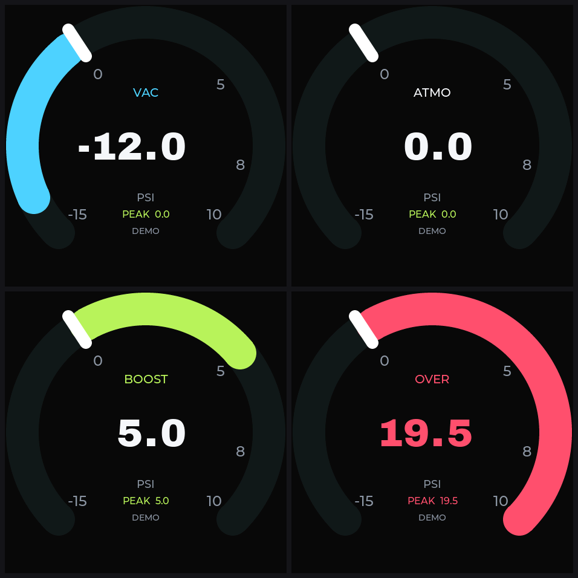
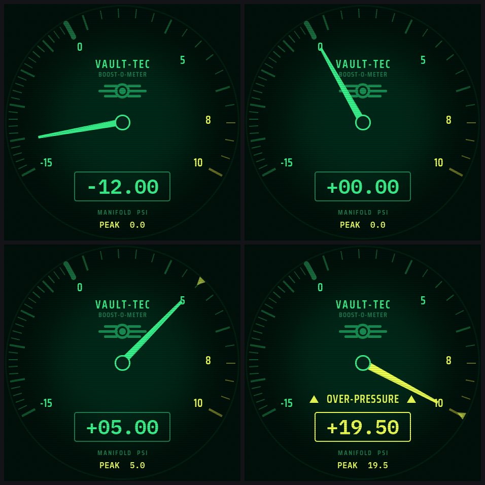
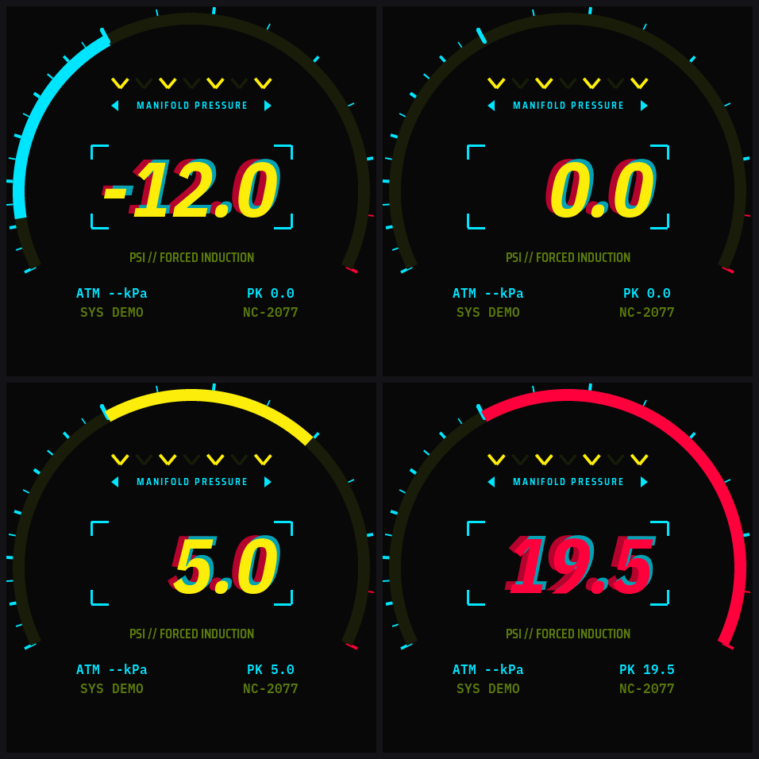
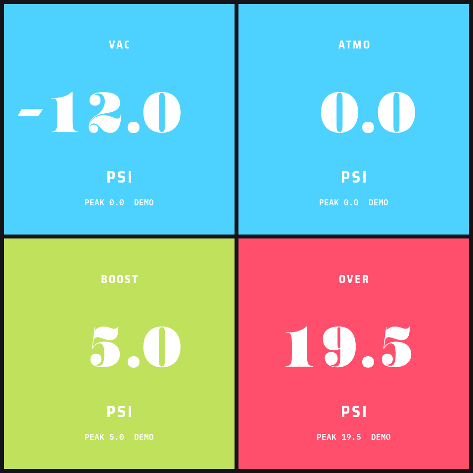
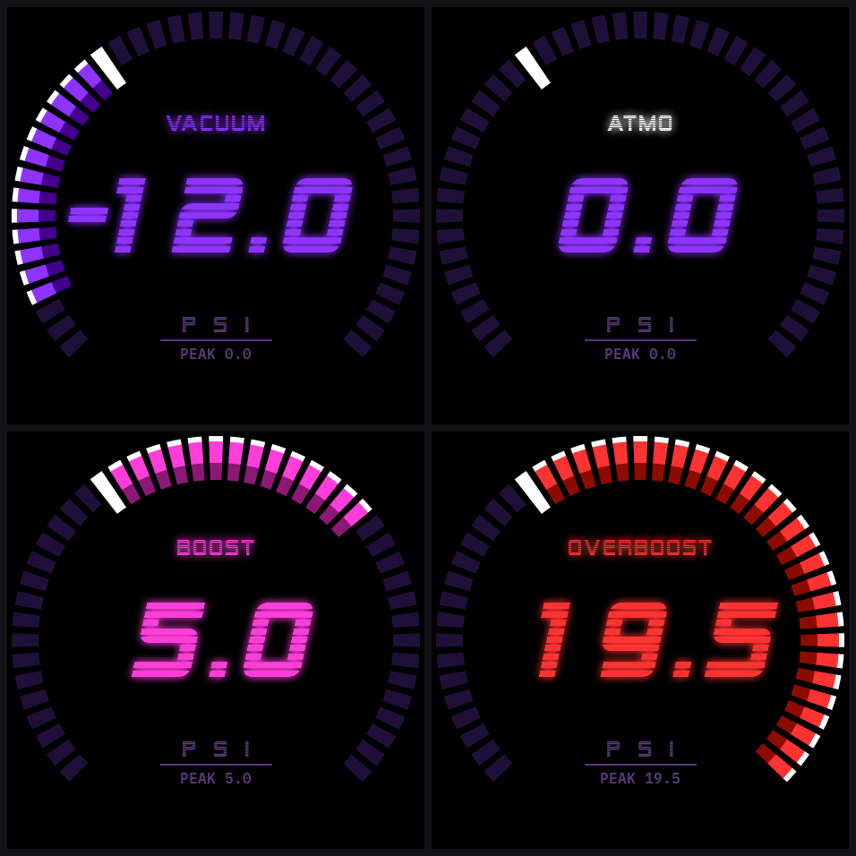

# Gauge face previews

Rendered by the headless LVGL simulator (`sim/`) — the same UI code that runs
on the board, not a mock. Each theme folder under `sim/<theme>/` holds the
five fixed-state snapshots below, a `gauge_sheet.png` 2x2 contact sheet, and
an animated `gauge_sweep.gif`.

| State | psi | Covers |
|---|---|---|
| `gauge_vac.png` | -12 | deep vacuum, near the dial floor |
| `gauge_atmo.png` | 0 | zero point / arc gap |
| `gauge_boost.png` | +5 | positive pressure with peak marker |
| `gauge_over.png` | +19.5 | past the 10 psi scale max (overshoot) |

## dyno-cell

The reference arc face — the 60 FPS cadence gate is measured on this one.



## vault-tec

Fallout-style face with CRT scanlines, vignette, and the two-triangle needle.



## night-city

Cyberpunk HUD ring with chromatic ghosting and true-black background.



## big-digit

Full-bleed numeric readout with quantized 24-band ground recolor.



## neon

Customizable neon-tube face: ring bands, 45-slot segment arc, bulb marquee
(rings/tube/segments layouts, SF Alien and Doto fonts).



Animated sweeps: [dyno-cell](sim/dyno-cell/gauge_sweep.gif) ·
[vault-tec](sim/vault-tec/gauge_sweep.gif) · [night-city](sim/night-city/gauge_sweep.gif) ·
[big-digit](sim/big-digit/gauge_sweep.gif) · [neon](sim/neon/gauge_sweep.gif)

## Regenerating

```bash
cmake -S sim -B sim/build && cmake --build sim/build -j
./sim/build/boost_gauge_sim --theme <id> --screenshot preview/sim/<id>
python3 sim/raw_to_png.py preview/sim/<id>
```

Theme ids: `dyno-cell`, `vault-tec`, `night-city`, `big-digit`, `neon`
(order defined in `main/boost_theme.c`).
